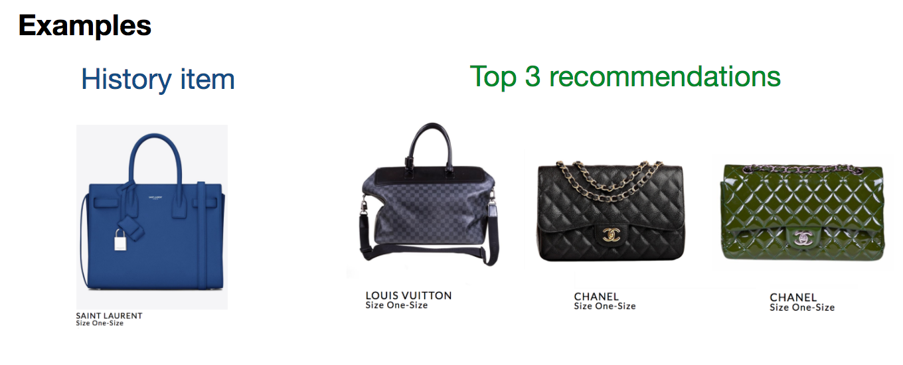

# Fashion Booster

## What is Fashion Booster?
Fashion Booster is a consulting project that I did for a fashion E-commerce
startup.
 My client company provides an *Airbnb-like* online marketplace,
 enabling women to lend or rent fashion items 
 including vacation bags, accessories, shoes, and clothes.
This project provides a series of data-driven solutions for my client
 to improve their business strategy.
 
 
 In particular, I performed extensive market analysis to estimate important metrics
 that investors care most about [Task 1: Market Analysis](#t1). 
 To help my client understand the profile of ideal customers, 
 I built a highly interpretable model to predict whether a customer will convert 
 [Task 2: Predicting user conversion](#t2).
 Finally, I developed a recommendation algorithm for customized 
 newsletter delivery, intending to increase their returning users
 [Task 3: Customized recommendation for users](#3).
 

## Task 1: Market Analysis

One of the most important metric related to financial modeling for startups
 is [payback period](http://www.portocapital.com/startup-financial-advice-metrics-payback-irr-gross-margin-porto-capital/),
 a metric evaluating the time span to recoup investment. This number can be estimated by 
 two other equally important metrics:
 
 - **CAC**, as you probably know, is the cost of convincing a potential customer to buy a product or service. 
 Here I defined it as the cost to acquiring an actual renter (as opposed to lender).
 - **LTV** is the projected revenue that a customer will generate during their lifetime. 
The lifespan of customers for a newly born startup is hard to estimate.
 Here I used a slightly modified metric **LTV per year**.
 
 

The payback period (in months) is then defined as CAC, divided by LTV then multiplied by 12.

*To protect the information of this company, detailed analysis results can only be found in the notebooks.
The actual numbers are hided for all graphs, and the link to the company's database is not provided.*

## Task 2: Predicting user conversion
When business owners are looking to increase their conversion rate, they could have different
definition on **conversion**, depending on their end business goals.
At this time, my client needs more E-commerce sales. Naturally,
 conversion means that a registered user converts to an actual renter. 

To help my client understand what are the strong factors that
 determine conversion rate, I built a Logistic Regression model 
 to predict whether a register user can convert, or not. 
 
 ### Feature Engineering
 First, I extracted some categorical features and numerical features
 from available user data and shopping history. There are two 
 noteworthy facts:
 
 - About 2/3 of the address information is 
 missing in the data set. For the users without address info, I used the package
 [python-geoip](http://pythonhosted.org/python-geoip/) to extract
 the city name from users' last login ip.
 - Age group can also be a determining factor. On this website, most
 of the registered users come from age group 25-30 while users from age group 30-35 
 contribute most to the revenue. Interestingly, users from 35-40 spend
 most for in a single order.

### Ensemble classifier

As mentioned before, only 3% of the users can convert to renters, with 97% of them not. 
I am building a classifier on these imbalanced data set.
Here I used a combination of **under sampling and ensemble method**. 
I first separate all the data in to 90% training + 10% test.
On the training dataset, I used all renters and under sampled
non-renters to train a 10-fold cross-validated classifier.
Finally, I make an ensemble using 10 such classifiers.

### Validation

The test of the ensemble classifier is performed on the remaining 10% of 
data.

I intentionally delete the feature *sign_in_counts* b/c,
which is strongly correlated to conversion and leads to 
a 99.9% F1-score when added back. This feature 
 undermines the importance of all the other features.
 
 Without considering sign-in counts, the ensemble classifier still does a reasonable 
 good job.

### Feature Importance

The average coefficient weights over 10 classifiers in the ensemble
tell us how predictive each feature is.
Several interesting findings here.

- Although the age determines users' expenditure, it is *not*
a strong indicator on conversion.
- *Domestic cities* did a better job than international cities, where
 my client does not have any campaign yet.
- Registering account by *FaceBook* or *hotmail*
can be a strong negative indicator. These
users might not provide their most frequently used emails, to 
spam advertisement.

## Task 3: Customized recommendation for users
For E-commerce, the value of returning visitors is greater
than first-time visitors [Business Insider](http://www.businessinsider.com/e-commerce-report-shows-returning-customers-are-more-valuable-than-new-ones-2016-3).
How to convert first-time visitors to returning visitors? 
My client has newsletter delivery to their sign-up browsers. Currently 
they add up items manually to their newsletter. A **customized 
recommendation** would definitely help to increase their returning users.
Therefore, I made some extra effort to build 
a customized recommendation algorithm for my client!

### Focusing on similar brands
The recommendation system select similar items for an user based on
his/her history records (such as shopping history or browsing history).
The algorithm starts with collaborative recommendations.
I first used all shopping history on the website 
to calculate the probability of co-rent for items coming 
from two different brands. 
This probability is a natural similarity measure for brands.
In current records, there are only around 20 brands having 
multiple rental history. 
For an item in an user's history, I will limit my
 recommendation to the *top 5* most similar
brands of this item. 

Here is the visualization of the similarity between top rented brands.

### Similarity between item description

Among the items coming from the selected brands, 
 we next pick up the items that are most similar to the history record.
 The similarity is determined by analyzing the semantic similarity 
 between item descriptions, through the following three steps:
 
 #### 1. Pick up key words
 
 Not every word in the description contributes to the characteristic
 of items. In this step, I only keep the words that are most relevant
 to an item's feature. In particular, 
 I removed the all the meaningless stop-words, *verbs*, and *adv*
 In the remaining words of *adj* and *noun*,
I kept their the dictionary form (this step is called lemmatization).
  
Here is the example on tokenized descriptions. Now the tokens mostly contain meaningful words!

#### 2. Word2vec

With the keywords in hand,
 I used the **word2vec** method to convert each keyword 
to a vector. Word2vec is a word embedding method that 
assign each unique word to a corresponding vector in a high-dimensional
(usually few hundreds) space, such that 
words that share common contexts in a large corpus are located 
in close proximity to one another.

#### 3. Earth Mover's Distance (Word Mover's Distance)
Word vector is a semantically meaningful representation of words that 
makes use of the co-occurrence of words in a large corpus.
With the word vector space in hand,
I use state-of-the-art method published in [ICML 2015](https://dl.acm.org/citation.cfm?id=3045221) to calculate the distance between descriptions.
This method calculates the dissimilarity between documents as 
the minimum amount of distance 
that the embedded words of one document need to "travel" 
to reach the embedded words of another document. The authors
defined this distance as Word Mover's Distance given the fact that
this distance can be exactly mapped to the Earth's mover's Distance, also
  known as [Wasserstein Distance](https://en.wikipedia.org/wiki/Earth_mover%27s_distance), a 
metric to compare distributions on D-dimensional space.

This method is particularly suitable for my problem because:

- Unlike bag-of-words method, this method doesn't rely on the counts of same
words in different descriptions, but consider the similarity between words
instead. Due to scarcity of data, I don't have enough repeat words in my description data.

- Sequence of words is not included in the method. Here all descriptions 
are input by users and naturally, there are grammar issues and incomplete sentences.

#### Example recommendation

Here is an example from my recommendation system.

## What's Next
Recommendation systems make product recommendations to customers and 
achieve a lot of success in E-commerce.  In this project, I incorporated
both collaborative recommendation on brands and customized aspects
based on users' renting history. For a startup E-commerce at very
 early state, I expect this recommendation to help them increase the percentage
 of returning users.
 
 
In principle, I should validate 
my recommendation by separating the data set into training and testing, 
making the top-*N* recommendation, and checking the [F1 score](http://aimotion.blogspot.com/2011/05/evaluating-recommender-systems.html)
against different hyper-parameter settings. Although this might not
be feasible on my current data set due to the scarcity of 
shopping history, it would be very interesting to do this validation
when more data has veen accumulated.
