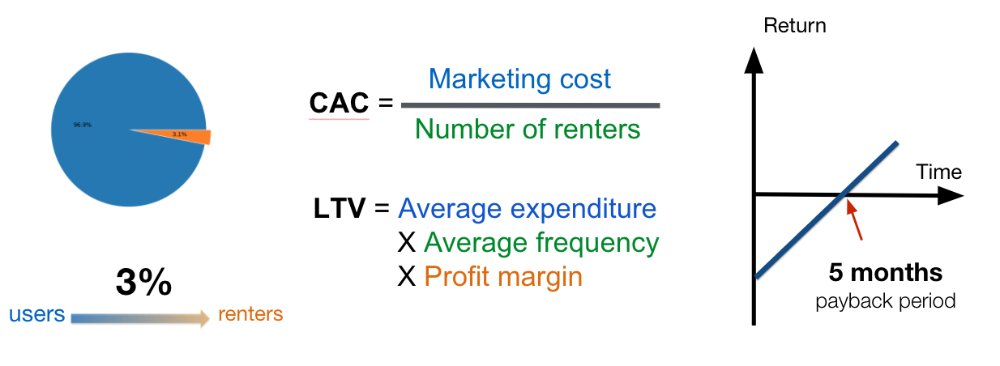
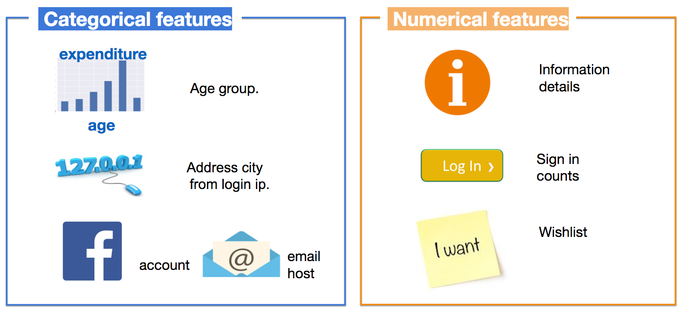
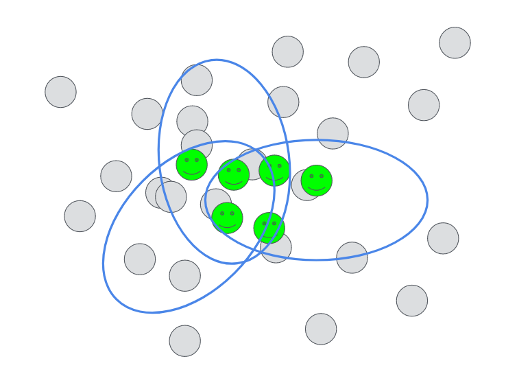
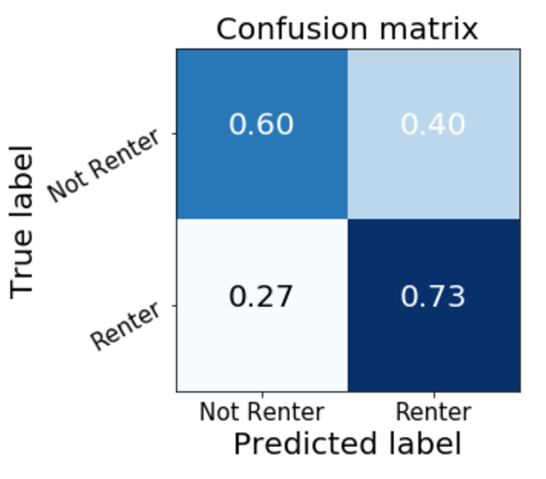
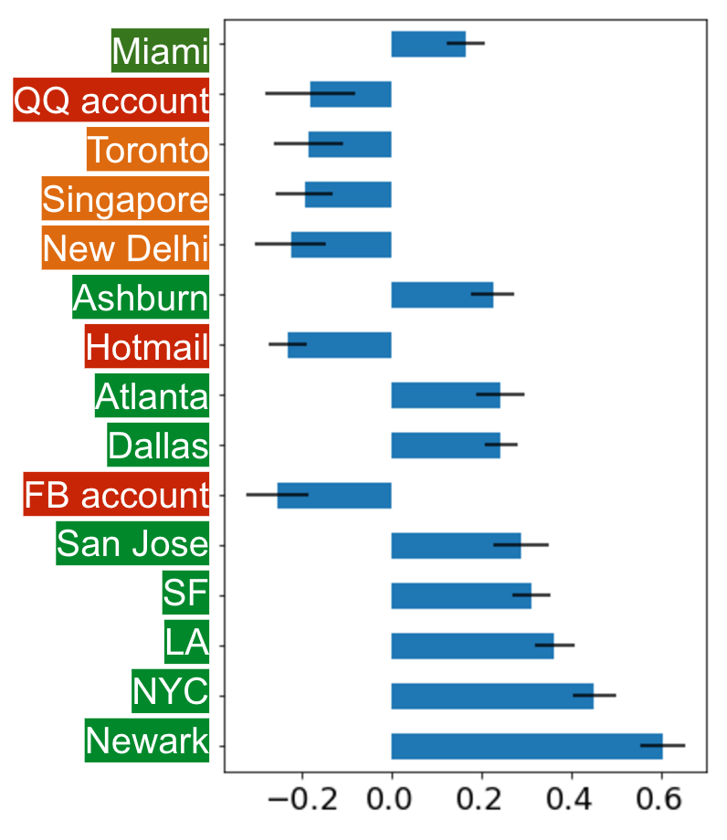
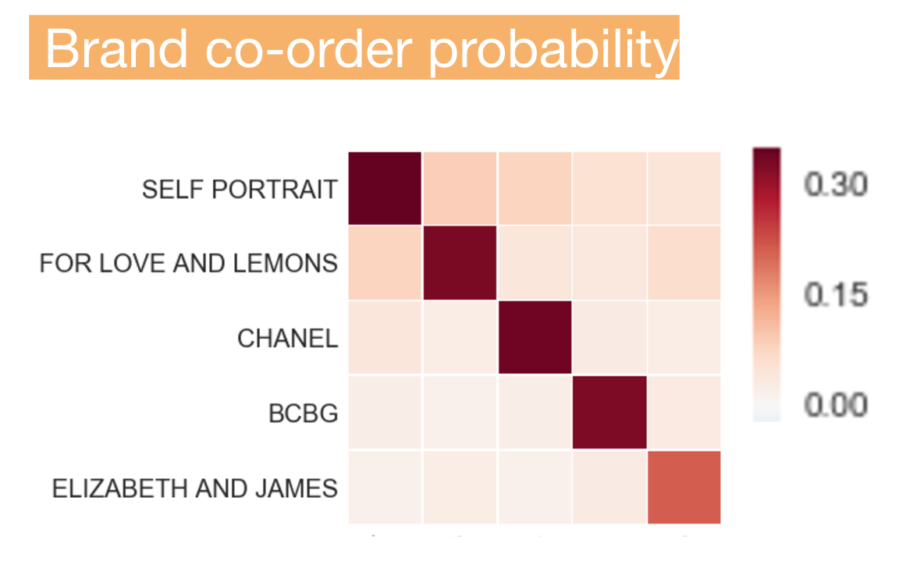
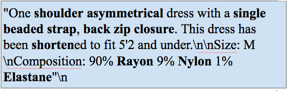
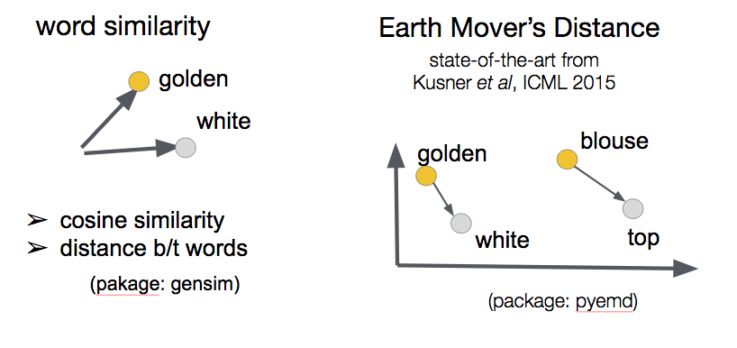

# Fashion Booster

## What is Fashion Booster?
Fashion Booster is a consulting project that I did for a fashion E-commerce
startup.
 My client company provides an online marketplace,
 enabling women to lend or rent fashion items 
 including vacation bags, accessories, shoes, and clothes.
It is an *Airbnb of women's closets*. 

 This project provides a series of data-driven solutions for my client
 to improve their strategy.
 In particular, I performed extensive market analysis to estimate important metrics
 that investors care most about [Task 1: Market Analysis](#t1). 
 To help my client understand the profile of ideal customers, 
 I also built a highly interpretable model to predict whether a customer will convert 
 [Task 2: Predicting user conversion](#t2).
 Finally, I built a recommendation system for customized 
 newsletter delivery to increase their returning users
 [Task 3: Customized recommendation for users](#3).
 

## Task 1: Market Analysis

One of the most important metric related to financial modeling for startups
 is [payback period](http://www.portocapital.com/startup-financial-advice-metrics-payback-irr-gross-margin-porto-capital/),
 a metric evaluating the time span to recoup investments. This number can be estimated by 
 two other equally import metrics:
 
 - **CAC**, as you probably know, is the cost of convincing a potential customer to buy a product or service. 
 Here I defined it as the cost to acquiring an actual shopper (in other words, renter).
 - **LTV** is the projected revenue that a customer will generate during their lifetime. 
 Because for this newly born startup it's hard to estimate lifespan a renter. 
 Here I used a modified version **LTV per year**.
 
 
 

The payback period (in months) is then defined as **CAC, divided by LTV, and multiplied by 12**.

*To protect the information of this company, detailed analysis results can only be found in the notebooks.
The actual numbers are hided for all graphs, and the true database link is not provided.*

## Task 2: Predicting user conversion
Will a registered user convert to an actual renter? 
Understanding user profile can help to increase conversion rate, a key metric
for E-commerce. To help my client understand what are strong indicators
 determining conversion rate, I built a Logistic Regression model 
 to predict whether a register user can convert. 
 
 First, I extracted some categorical features and numerical features
 from available user data and shopping history.

### Ensemble classifier

Before moving on to train the model, we notice that our data is 
highly imbalanced. Only 3% of the users can convert to renters, with 97% of them not. 
Here I used a combination of undersampling and ensemble method. In particular,
I trained 20 models with each using 80% randomly selected renters and equal number
of non-renters. These 20 models are made as an ensemble classifier, in which
the classification is determined by the decision of majority of models.

### Validation

The test of the ensemble classifier is performed on 20% of the orginal imbalanced 
data. 

In the following graph, I intentionally delete the feature *sign_in_counts* b/c this
feature is too strong that the classification accuracy could be as high as 0.99 when adding
it back in. This feature dims the importance of all other features.

### Feature Importance

The average coefficient weights tell us on how predictive the features are.
Several interesting findings here.

- Although the age determines how much one spend on the website, it is **not**
a strong indicator on conversion.
- Domestic cities did a better job than international cities, which is later
 confirmed by my clients b/c they do have representatives in big domestic cities.
- Email account is a strong negative indicator, registering by FaceBook or hotmail 
might not provide their most frequently used emails.

## Task 3: Customized recommendation for users
The recommendation is based on the renters'shopping history and the similarities between all available items using the description text of items stored in my client's database. The model also takes advantages of renters' size records, brand preferences, and cloth type preferences.
We start with collaborative recommendations. We use the order history on the website to calculate the probability of co-rent for items from two different brands. This probability serves as a natural similarity measure for brands.

A natural way to proceed would be clustering the brand according to their similarity matrix. However, we don't have enough data to do that b/c there are only around 20 brands having multiple rental history. Instead, when we make recommendations based on an user's shopping history, we will first select some similar brands and make further filtering from all the items of these similar brands.

Here we visualize the similaries for top rented brands.

Not every word in the description contributes to the **characteristic** of the item.

When we tokenize the description, we first remove the meaningless stop-words (using the list provided by **nltk** package), such as *he, is, at, which, and on*.

Second, we notice that neither *verb* (such as can, do, are) or *adv* (such as very, great, slightly) contribute much. We use the **part-of-speech** package to class words into nouns, verbs, adjectives, and adverbs. We only keep the nons and adjectives in tokens.

Here is the example on tokenized descriptions. Now the tokens mostly contain meaningful words!

### Word2vec

With the tokens in hand, one way to compare the similarities would be the bag-of-words counts. However, I don't have enough description items in my inventory, the recurrence of words is low and the description is highly determined by the lenders' personal language choice. 

Therefore, we use the word2vec method to first convert each word in the tokenized description to a vector, and then use the cosine similarity between words to calculate the similarities between words.

With the similarity metric between words in hand, we use state-of-the-art method published in [ICCV 2015](https://dl.acm.org/citation.cfm?id=3045221) to calculate the distance between descriptions.

This method regards each tokenized description as a distribution of sands over some spots (each spot represent a word). The similarity between words can be viewd as a distance metric between spots. In particular, higher similarity score indicates shorter distances between words. The Earth Mover's Distance is the minimum *energy* that costs to reshape one sand distribution to the other. This distance is the measure on how clost two descriptions are. 

The method doesn't based on the count of same words nor on the sequence of words, which makes it especially suitable for my problem: 

- Sequence of words is not important here b/c all descriptions are input by users. That is to say, there are grammer issues and incomplete senetenece.
- Word counts similarity is difficult here b/c the number of descpritions is limited. Users have some preference on wording. And there are not too much repeating words in the corpus. 

Particulary, We define the inverse of description distance as the the similarity.

## What's Next
Recommendation systems make product recommendations to customers and 
achieve a lot of success in E-commerce.  In this project, I incorporated
both collaborative recommendation on brands and customized aspects
based on users' renting history. For a startup E-commerce at very
 early state, I expect this recommendation to help them increase the percentage
 of returning users.
 
 
In principle, I should validate 
my recommendation by separating the data set into training and testing, 
making the top-*N* recommendation, and checking the [F1 score](http://aimotion.blogspot.com/2011/05/evaluating-recommender-systems.html)
against different hyper-parameter settings. Although this might not
be feasible on my current data set due to the scarcity of 
shopping history, it would be very interesting to do this validation
when more data has veen accumulated.
